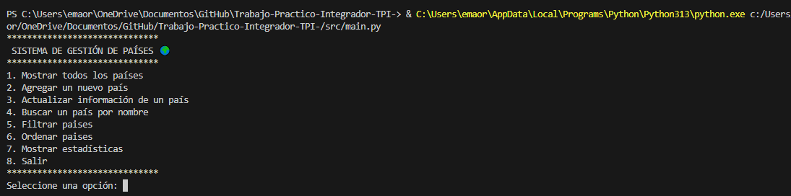
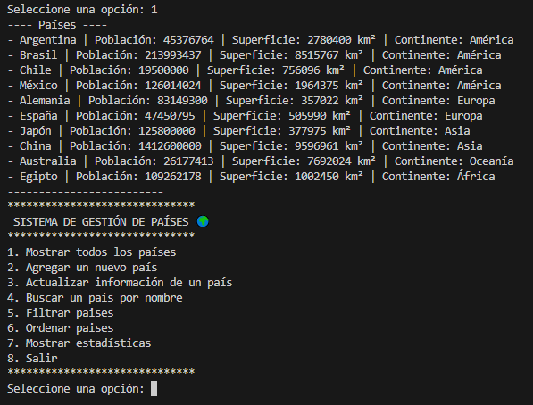

# 🌍 Trabajo Práctico Integrador – Programación 1  
### Gestión de Datos de Países en Python  

---
**Emanuel Ortigoza**

---
**Javier Soliz**


---

## 🧩 Descripción general

Este proyecto consiste en un programa en Python que permite administrar información de países mediante un archivo CSV.  
El sistema permite mostrar, agregar, buscar, actualizar y analizar países.  
Fue desarrollado sin el uso de bloques `try/except`, cumpliendo con los lineamientos de la cátedra.


El código está dividido en módulos para favorecer la **modularización** y el **trabajo en equipo**.

---

## 📁 Estructura del Proyecto
```
TPI_Paises/
├── data/
│   └── data_paises.csv
├── src/
│   ├── funciones_basicas.py
│   ├── funciones_avanzadas.py
│   └── main.py
├── docs/
│   └── informe_teorico.pdf
└── README.md
```

---

## ▶️ Ejecución del Programa




---

## 🧱 Funcionalidades Principales
- Mostrar todos los países registrados.
- Agregar un nuevo país (con validaciones completas).
- Actualizar población o superficie.
- Buscar países por nombre o coincidencia parcial.
- Ordenar países por población o superficie.
- Filtrar países por continente.
- Mostrar estadísticas generales.

---

## 🧩 Validaciones
- No se permiten campos vacíos.  
- Población y superficie deben ser enteros positivos.  
- No se admiten duplicados.  
- El nombre solo puede contener letras, espacios y guiones.  
- El continente debe pertenecer a la lista válida:  
  **América, Europa, Asia, África, Oceanía o Antártida.**

---

## 📊 Ejemplo de Estructura del CSV
```
nombre,poblacion,superficie,continente
Argentina,45376763,2780400,América
Japón,125800000,377975,Asia
Australia,26177413,7692024,Oceanía
```

---

## 🧠 Aprendizajes
Este proyecto ayudó a reforzar conceptos de listas, diccionarios, funciones, validaciones y manejo de archivos CSV.  
También permitió practicar la organización modular del código y la validación manual de entradas sin excepciones.

---

## 🏁 Conclusión
El sistema cumple con los requerimientos propuestos y se encuentra en funcionamiento estable.  
Representa una buena base para futuros proyectos en Python, donde se pueda seguir ampliando con nuevas funciones y análisis.
